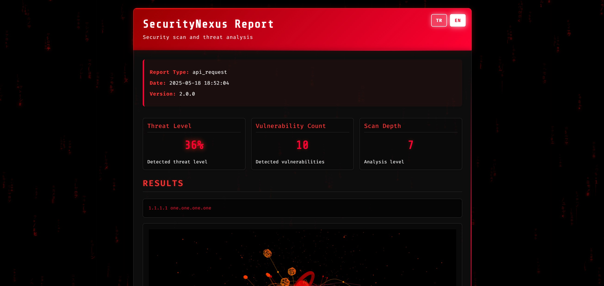
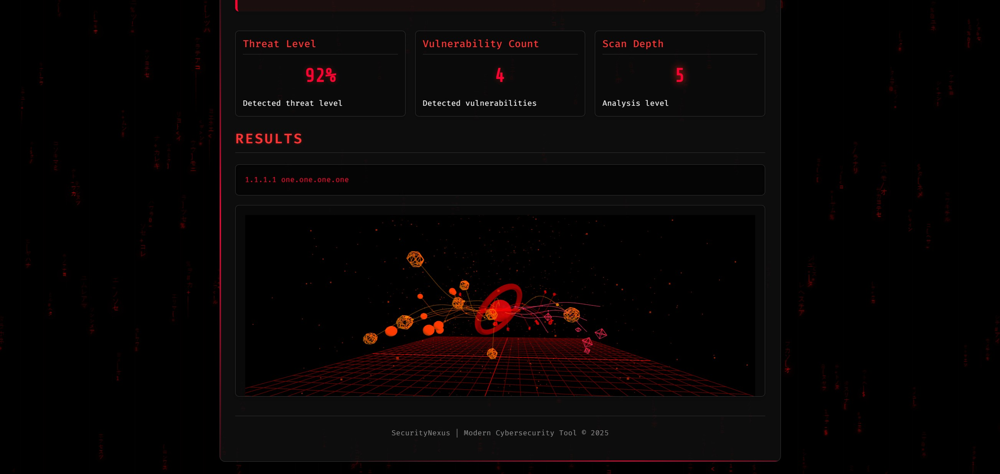

# SecurityNexus - Advanced Network Intelligence Suite





SecurityNexus (formerly PySecurity And CyberSentry) is a command-line cybersecurity tool that offers various functions in network security and digital forensics. It is designed for security professionals, network administrators, and cybersecurity enthusiasts.

## Table of Contents
- [Technical Architecture](#technical-architecture)
- [Features](#features)
- [Installation](#installation)
- [Usage](#usage)
- [Configuration](#configuration)
- [Supported Languages](#supported-languages)
- [License](#license)
- [Contributors](#contributors)

## Technical Architecture

SecurityNexus is a Python-based system developed with a modular and extensible structure.

### Project Structure
```
SecurityNexus/
├── config/               # Configuration files and requirements
├── core/                 # Core functionality and configuration management
│   ├── config.py         # Configuration loading and language functions
│   └── menu_theme.py     # Menu and UI components
├── modules/              # Main functionality modules
│   ├── dns.py            # DNS operations
│   ├── network.py        # Network operations
│   ├── security.py       # Security checks
│   ├── osint.py          # OSINT tools
│   ├── threat_intel.py   # Threat intelligence
│   ├── ml_anomaly.py     # Machine Learning based anomaly detection
│   ├── log_analysis.py   # Log analysis functions
│   └── settings.py       # Settings management
├── history/              # Operation history records
├── reports/              # Generated reports
├── utils/                # Helper functions
│   └── helpers.py        # Helper utilities
├── main.py               # Main application file
└── setup.bat             # Setup script
```

### Technical Features

- Command-line application based on **Python 3.6+**
- Machine learning-based anomaly detection with **TensorFlow** and **PyTorch**
- Blockchain security analysis with **Web3** integration
- **API Integrations**:
  - HackerTarget
  - Have I Been Pwned
  - AlienVault OTX
  - MISP
  - ThreatFox
  - Shodan
- Advanced terminal user interface with **Colorama**
- Interactive menu system with **blessed** and **inquirer**
- Secure data processing with modern encryption (cryptography, pycryptodome)
- Data visualization with **NetworkX** and **Pandas**
- Concurrent task execution with multi-threading

### Data Flow

1. User inputs are processed by the relevant class methods under `modules/`
2. `core/config.py` provides multi-language support and configuration management
3. Operations are recorded in JSON format in the `history/` folder
4. Reports are generated in HTML, JSON, or TXT format under `reports/`

## Features

SecurityNexus offers the following features through a modern and user-friendly interface:

### DNS Operations
- **Reverse DNS Lookup:** Query domain names corresponding to IP addresses
- **DNS Lookup:** Query IP addresses corresponding to domain names
- **Zone Transfer:** DNS zone transfer testing
- **DNS Host Records:** List DNS host records for a domain
- **DNS Records:** View all DNS records
- **DNSSEC Verification:** DNS security check

### Network Operations
- **IP Geolocation:** Detect the geographic location of an IP address
- **Reverse IP Lookup:** List domain names associated with an IP address
- **ASN Query:** Query Autonomous System Number information
- **Privacy API:** Check IP privacy information
- **IPv6 Proxy Check:** Check if IPv6 addresses are proxies
- **Port Scanner:** Scan open ports on target systems

### Security Checks
- **Email Validator:** Validate email address validity
- **Data Breach Check:** Check if an email address has been involved in data breaches
- **DMARC Query:** Check domain DMARC records
- **TLS Scan:** Analyze TLS/SSL configuration
- **JS Security Scanner:** Check for JavaScript security issues
- **URL Bypass Tool:** Determine the real targets of shortened URLs
- **SSL Certificate Info:** Check SSL certificate details

### Threat Intelligence
- **MISP Integration:** Check indicators on the MISP threat intelligence platform
- **AlienVault OTX:** Search for threats on Open Threat Exchange
- **ThreatFox:** Query malware IOCs from ThreatFox database

### Vulnerability Scanning
- **CVE Search:** Search for specific CVE details
- **Product CVE Search:** Find vulnerabilities for specific products
- **CVE Severity Check:** List recent vulnerabilities by severity level

### OSINT Tools
- **Shodan Host Search:** Gather information about hosts from Shodan
- **WHOIS Query:** Get domain registration information
- **Domain OSINT Analysis:** Collect comprehensive domain intelligence

### Machine Learning Based Analysis
- **Anomaly Detection:** Detect abnormal behavior in network traffic with ML models
- **Behavior Analysis:** Detect deviations in user and system behaviors
- **Threat Scoring:** Score threat indicators with machine learning

### Advanced Log Analysis
- **Event Correlation:** Correlate log events from different sources
- **Pattern Detection:** Detect suspicious patterns in log files
- **Anomaly Identification:** Identify deviations from normal behavior

### Blockchain Security
- **Smart Contract Analysis:** Security analysis of Solidity-based contracts
- **Blockchain Tracking:** Track suspicious transactions
- **Web3 Security Check:** DApp security analyses

### Additional Features
- **Bulk Scanning:** Scan multiple targets at once
- **Scheduled Tasks:** Automatically scan at specific time intervals
- **History:** View results of previous scans
- **Data Export:** Export results in HTML, JSON, or TXT format
- **Check for Updates:** Check for the latest version

### System Features
- Modern, arrow key navigable menu system
- Multi-language support (English, Turkish)
- Fully customizable configuration system
- Report generation in HTML, JSON, and TXT formats
- Concurrent scanning support

## Installation

### Requirements
- Python 3.6 or higher
- Library dependencies: 50+ Python modules (see config/requirements.txt for detailed list)

### Installation Steps

#### Standard Installation

1. Clone the repository:
```
git clone https://github.com/MrX0955/SecurityNexus.git
cd SecurityNexus
```

2. Install required libraries:
```
pip install -r config/requirements.txt
```

Or for Windows users:
```
setup.bat
```

3. Start the application:
```
python main.py
```

Windows users can also run the `start.bat` file.

#### Docker Installation

1. Using Docker Compose (recommended):

Windows:
```
start-docker.bat
```

Linux/macOS:
```
chmod +x start-docker.sh
./start-docker.sh
```

2. Manual Docker CLI:
```
# İmajı oluştur
docker build -t securitynexus .

# Konteyner başlat (interaktif mod)
docker run -it --name securitynexus \
  -v $(pwd)/reports:/app/reports \
  -v $(pwd)/history:/app/history \
  -v $(pwd)/config:/app/config \
  securitynexus
```

Windows PowerShell'de:
```
docker run -it --name securitynexus `
  -v ${PWD}/reports:/app/reports `
  -v ${PWD}/history:/app/history `
  -v ${PWD}/config:/app/config `
  securitynexus
```

3. To stop Docker containers:

Windows:
```
stop-docker.bat
```

Linux/macOS:
```
./stop-docker.sh
```

## Usage

When the application is running, you can navigate the menu using the arrow keys and Enter key:

1. Select a category from the main menu (DNS Operations, Network Operations, etc.)
2. Select the desired function from the submenu
3. Enter the requested information (IP, domain name, etc.)
4. View the results and generate a report if needed

### API Keys

Some functions may require API keys:
- `hackertarget`
- `hibp` (Have I Been Pwned)
- `misp` (MISP Threat Intelligence)
- `otx` (AlienVault OTX)
- `threatfox` (ThreatFox)
- `shodan` (Shodan)

You can add these API keys to the relevant fields in the `config/config.json` file.

## Configuration

You can customize the following settings through the `config/config.json` file:

- Language selection (English and Turkish)
- Report saving options
- Report format (HTML, JSON, TXT)
- Automatic update check
- Concurrent task limit
- Request timeout duration

## Supported Languages

- English
- Turkish
- **More Language Coming Soon**

To add a new language, you can add translations to the `config/languages.json` file.

## License

This project is licensed under the SecurityNexus LICENSE. The following license terms apply to SecurityNexus:

```
SecurityNexus License Agreement

Copyright (c) 2025 SecurityNexus

This license agreement governs the use of the SecurityNexus software. By using the software, you agree to the following terms:

1. RIGHT OF USE: You may use SecurityNexus software only for educational and personal use purposes. Commercial use, copying, modification, or distribution of the software is strictly prohibited. All rights belong to the SecurityNexus team.

2. LEGAL USE: You agree to use the software only for legal purposes. SecurityNexus does not encourage illegal activities in any way, and all responsibility for using the software in illegal activities rests entirely with the user.

3. DISCLAIMER: The software is provided "as is". The SecurityNexus team does not guarantee that the software will work error-free or uninterrupted. All risks and responsibilities arising from the use of the software belong to the user.

4. DIRECT AND INDIRECT DAMAGES: The SecurityNexus team is not responsible for any direct or indirect damages resulting from the use of the software. The user is responsible for any data loss, system damage, or any other damage that may occur as a result of using the software.

5. SECURITY: You are solely responsible for the security of the data you obtain using the software. It is your responsibility to properly protect sensitive information. SecurityNexus cannot be held responsible for the security of user data.

6. PRIVACY: SecurityNexus does not collect or process your personal data. Reports and analysis results generated by the software are stored only locally, and it is the user's responsibility to protect this data.

7. THIRD-PARTY SERVICES: SecurityNexus may use third-party APIs for some functions. The use of these services is subject to their own terms of use. SecurityNexus is not responsible for any issues that may arise with these third-party services.

8. UPDATES: SecurityNexus software may be updated from time to time to provide a better user experience. By accepting updates, you acknowledge that you will use the most current version and will be subject to the current version of this agreement.

9. AGREEMENT CHANGES: The SecurityNexus team reserves the right to change this agreement at any time. Changes will be announced in subsequent versions of the software. Your continued use of the software means that you accept the updated terms.

10. TERMINATION: In case of a breach of this agreement, the SecurityNexus team has the right to immediately terminate your right to use the software. In addition, it reserves the right to initiate legal proceedings in case of inappropriate or malicious use of the software.

By accepting these terms of use, you confirm that you have read and understood the above terms and take full responsibility. 
```

## Contributors

- [CleinKelvinn](https://github.com/MrX0955)
- [Raven](https://github.com/raventrk)

---

**Note**: SecurityNexus is designed for educational and testing purposes. The user is responsible for any consequences that may arise from malicious use or misuse. Always use within legal limits and with necessary permissions.
